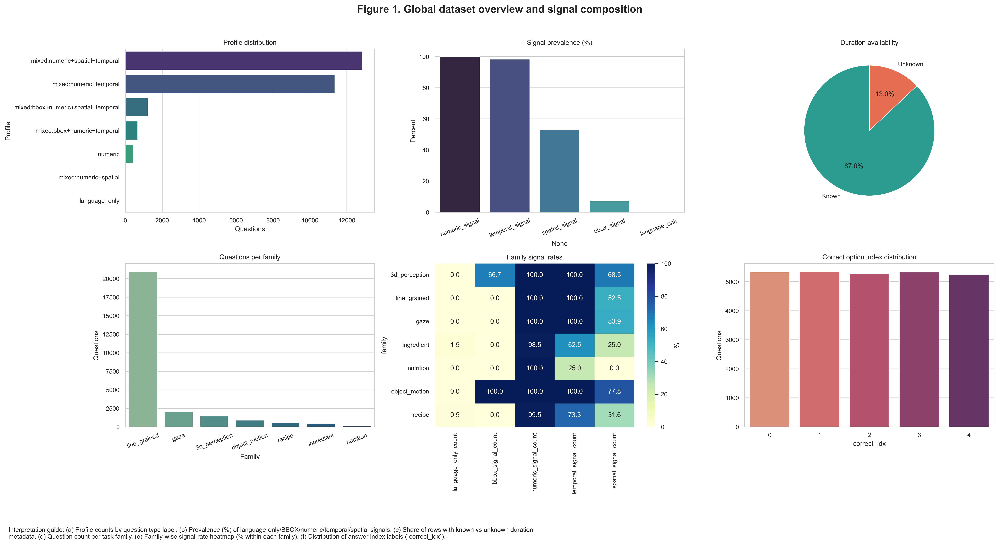
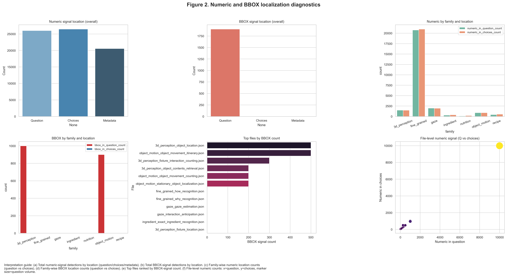
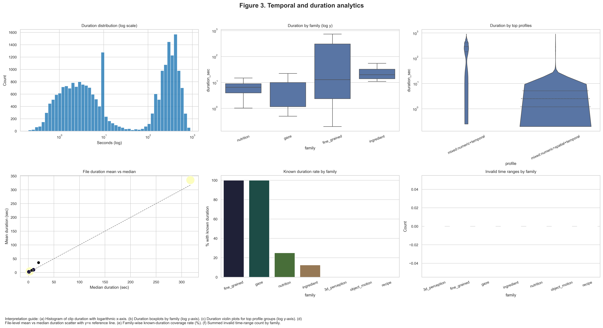
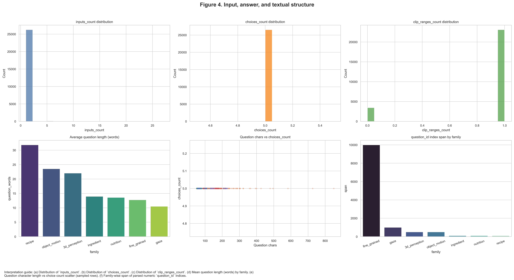
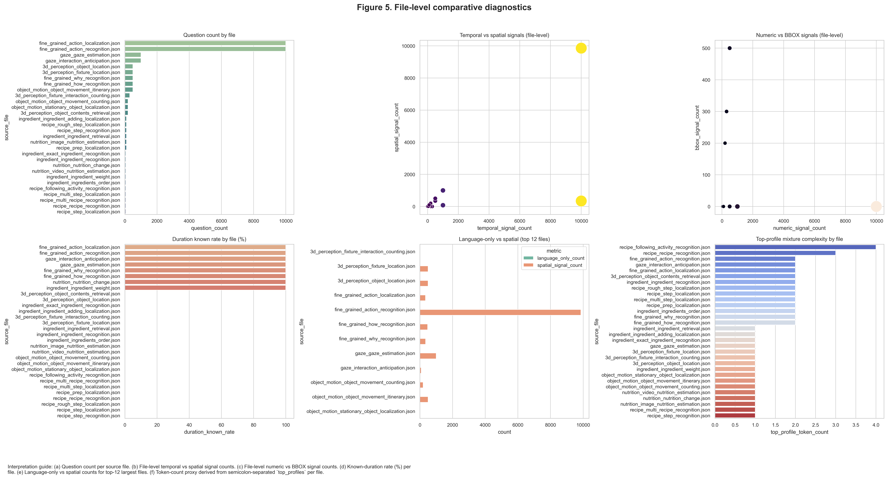
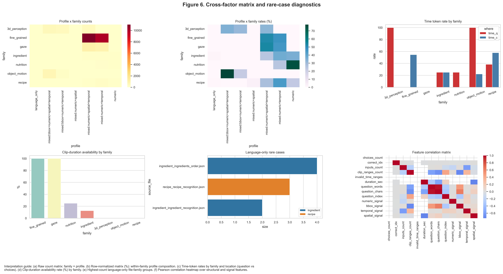
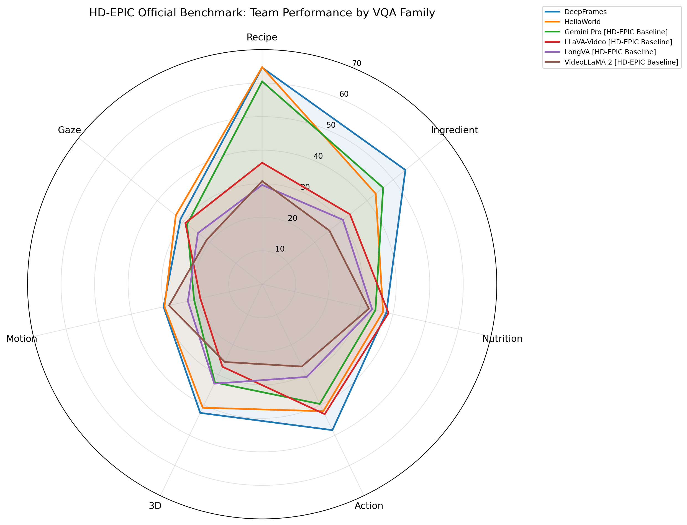
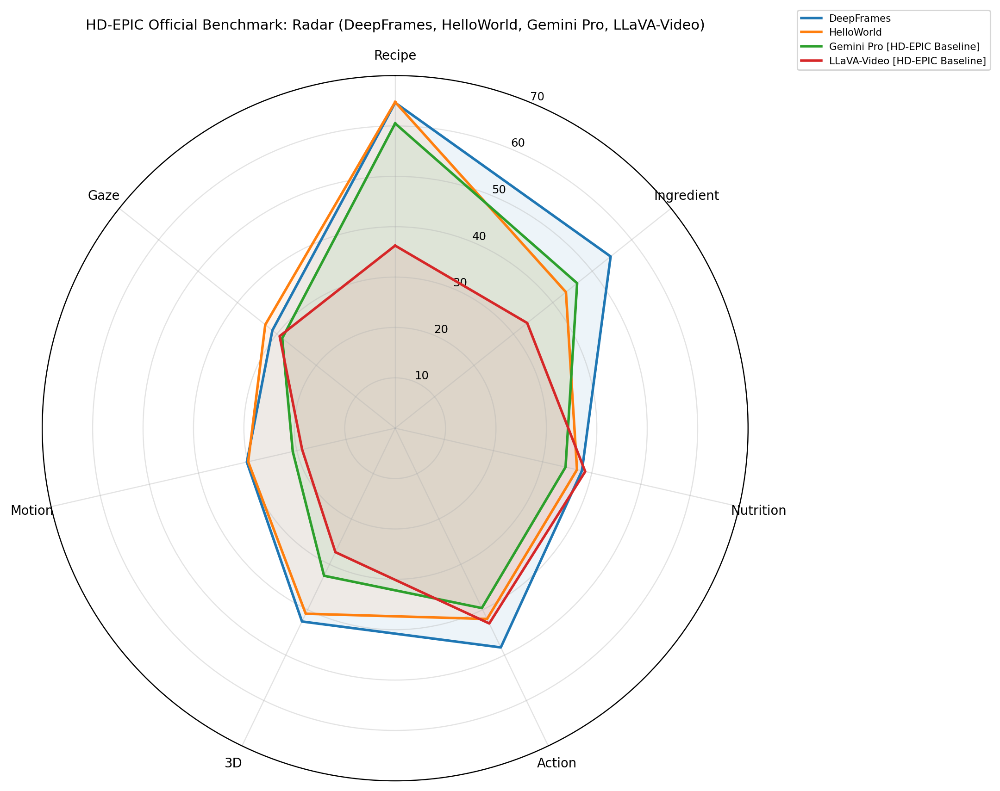
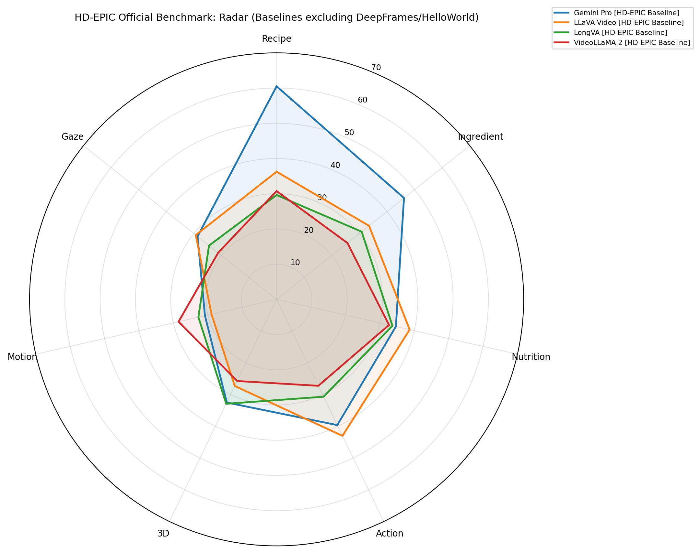

# Figure Gallery (Embedded)

This page embeds all generated figure PNGs from this folder for quick visual review.

## Figure 1 — Global overview
- PNG: `fig01_global_overview.png`
- PDF: `fig01_global_overview.pdf`

## Figure 2 — Numeric/BBOX locality
- PNG: `fig02_numeric_bbox_locality.png`
- PDF: `fig02_numeric_bbox_locality.pdf`

## Figure 3 — Duration analytics
- PNG: `fig03_duration_analytics.png`
- PDF: `fig03_duration_analytics.pdf`

## Figure 4 — Input/answer structure
- PNG: `fig04_input_answer_structure.png`
- PDF: `fig04_input_answer_structure.pdf`

## Figure 5 — File-level comparison
- PNG: `fig05_file_level_comparison.png`
- PDF: `fig05_file_level_comparison.pdf`

## Figure 6 — Cross-factor matrix
- PNG: `fig06_cross_factor_matrix.png`
- PDF: `fig06_cross_factor_matrix.pdf`

## Figure 7 (legacy) — Official leaderboard radar
- PNG: `fig07_official_leaderboard_radar.png`
- PDF: `fig07_official_leaderboard_radar.pdf`

## Figure 7a — Official leaderboard radar (top group)
- PNG: `fig07a_official_leaderboard_radar_top_group.png`
- PDF: `fig07a_official_leaderboard_radar_top_group.pdf`

## Figure 7b — Official leaderboard radar (baselines only)
- PNG: `fig07b_official_leaderboard_radar_baselines_only.png`
- PDF: `fig07b_official_leaderboard_radar_baselines_only.pdf`

## Figure 8 — Leaderboard difficulty composite
- PNG: `fig08_leaderboard_difficulty_composite.png`
- PDF: `fig08_leaderboard_difficulty_composite.pdf`

## Large-duration diagnostics — Duration by JSON type
- PNG: `big_duration_by_json_type.png`
- PDF: `big_duration_by_json_type.pdf`

## Large-duration diagnostics — Effective duration by JSON type
- PNG: `big_effective_duration_by_json_type.png`
- PDF: `big_effective_duration_by_json_type.pdf`

