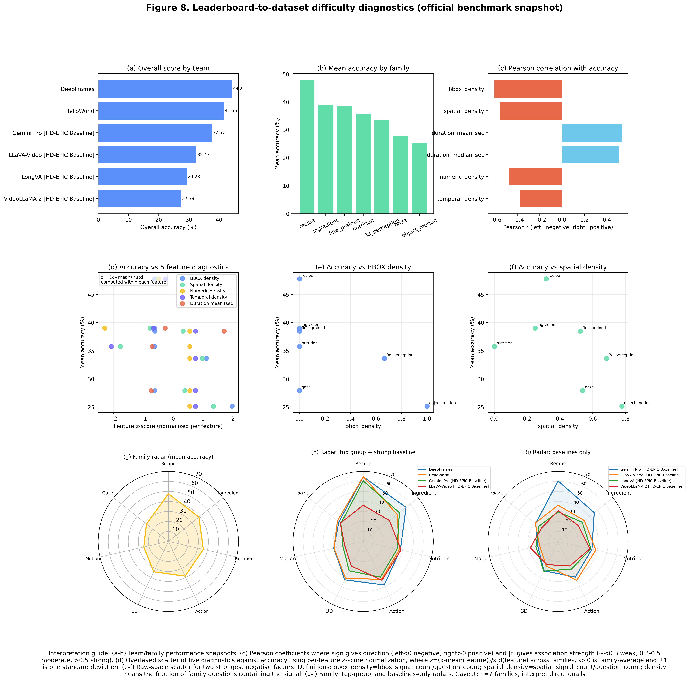

# Leaderboard Difficulty Diagnostics

This report compares official family-level benchmark accuracy (6 participants) against family-level dataset diagnostics from `vqa_summary_by_family.csv`.

## Key caveat
- Correlations are computed over only 7 VQA families, so they are directional diagnostics rather than statistically robust claims.

## Hardest families by mean accuracy
- object_motion: 25.18%
- gaze: 27.96%
- 3d_perception: 33.66%
- nutrition: 35.78%
- fine_grained: 38.48%
- ingredient: 39.03%
- recipe: 47.75%

## Strongest feature correlations with accuracy (by |Pearson r|)
- bbox_density: Pearson r=-0.605248, Spearman rho=-0.668153 (n=7)
- spatial_density: Pearson r=-0.554777, Spearman rho=-0.714286 (n=7)
- duration_mean_sec: Pearson r=0.533733, Spearman rho=0.8 (n=4)

## How to interpret correlation and significance
- Correlation here is directional: negative values mean higher feature density tends to align with lower family mean accuracy; positive values mean the opposite.
- Significance is limited by sample size (7 families, and only 4 for duration features), so these should be treated as diagnostic trends rather than statistically definitive claims.
- Most consistent negative associations with mean accuracy are `bbox_density`, `spatial_density`, and `numeric_density`; `temporal_density` is also negative but weaker.
- Duration features show a positive trend in this snapshot, but because n=4 they are less stable and should be interpreted cautiously.

## Feature definitions used in Figure 8
- `bbox_density = bbox_signal_count / question_count`
- `spatial_density = spatial_signal_count / question_count`
- Panel (d) x-axis uses per-feature z-score: `z = (x - mean(feature)) / std(feature)` computed across families.

## Composite figure preview

## Generated artifacts
- Radar chart (top group): `analysis-output\figures\fig07a_official_leaderboard_radar_top_group.png` and `analysis-output\figures\fig07a_official_leaderboard_radar_top_group.pdf`
- Radar chart (baselines only): `analysis-output\figures\fig07b_official_leaderboard_radar_baselines_only.png` and `analysis-output\figures\fig07b_official_leaderboard_radar_baselines_only.pdf`
- Family accuracy table: `analysis-output\leaderboard_family_accuracy.csv`
- Correlation table: `analysis-output\leaderboard_accuracy_correlations.csv`
- Composite figure: `analysis-output\figures\fig08_leaderboard_difficulty_composite.png` and `analysis-output\figures\fig08_leaderboard_difficulty_composite.pdf`
